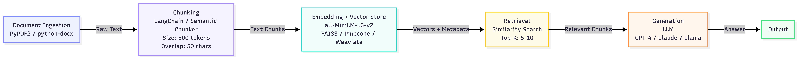

# Project 1 Planning: The Unofficial Guide

> Write this document before you write any pipeline code.
> Your spec and architecture diagram are what you'll use to direct AI tools (Claude, Copilot, etc.) to generate your implementation — the more specific they are, the more useful the generated code will be.
> Update the Retrieval Approach and Chunking Strategy sections if you change your approach during implementation.
> Update this file before starting any stretch features.

---

## Domain

<!-- What domain did you choose? Why is this knowledge valuable and hard to find through official channels? -->
The domain of my choice is information regarding the undergraduate experience at the University of California, Irvine. THe information from sources I've chosen span a range of topics from registration, housing resources, navigating difficult courses, etc. This knowledge isn't well known for students learning to live and study for the first time in their lives. A lot of the Reddit information is knowledge passed down from past students which alleviates a bit of the learning curve and builds a sense of community.
---

## Documents

<!-- List your specific sources: URLs, subreddit names, forum threads, or file descriptions.
     Aim for at least 10 sources that together cover different subtopics or perspectives within your domain. -->

| # | Source | Type | URL or file path |
|---|--------|------|-----------------|
| 1 |Reddit | Website|https://www.reddit.com/r/UCI/
| 2 |Reddit |Website |https://www.reddit.com/r/UCI/comments/1jckpkn/first_year_housing_scoop/
| 3 |Reddit |Website |https://www.reddit.com/r/UCI/comments/1jh388v/current_incoming_2029_students_faq_megathread/
| 4 |Reddit | Website|https://www.reddit.com/r/UCI/comments/w1ooph/how_to_request_assistance_in_a_time_of_crisis/
| 5 | Reddit| Website|https://www.reddit.com/r/UCI/comments/vfp0la/uci_housing_megathread_20222023/
| 6 |UCI Official Site|Website |https://www.admissions.uci.edu/study/majors-minors.php?type=Major
| 7 |Reddit | Website|https://www.reddit.com/r/UCI/comments/1d25n2j/
| 8 | Reddit|Website |https://www.reddit.com/r/UCI/comments/1d25n2j/comp_sci_majors_are_you_struggling_to_find_a_job/
| 9 | Reddit|Website |https://www.reddit.com/r/UCI/comments/194da57/why_are_cs_majors_so_gross/
| 10 |Reddit | Website|https://www.reddit.com/r/UCI/comments/1t57ayb/tips_for_prospective_undergraduate_cs_majors_at/
| 11 |Reddit |Website |https://www.reddit.com/r/UCI/comments/1sy66rb/uci_international_students_fall_2026_winter_2027/

---

## Chunking Strategy

<!-- How will you split documents into chunks?
     State your chunk size (in tokens or characters), overlap size, and explain why those
     numbers fit the structure of your documents.
     A review-heavy corpus warrants different chunking than a long FAQ. -->

**Chunk size:**
300

**Overlap:**
50

**Reasoning:**
Most of the information is extracted from medium to long length, opinion-based posts and a lot of the information to questions I garnered could be answered in about 1-3 sentences which approximately fits the size of 300 characters. I chose 50 as the overlap in case some sentences show connection or relevance to each other. 50 characters seems appropriate because it's approximately the size of a sentence so if it gets cut off or is related somehow to another chunk, any relevant information will not get lost.

---

## Retrieval Approach

<!-- Which embedding model are you using (e.g., all-MiniLM-L6-v2 via sentence-transformers)?
     How many chunks will you retrieve per query (top-k)?
     If you were deploying this for real users and cost wasn't a constraint, what tradeoffs
     would you weigh in choosing a different embedding model — context length, multilingual
     support, accuracy on domain-specific text, latency? -->

**Embedding model:**
I will be using the all-MiniLM-L6-v2 which seems appropriate given most of my resources are short to medium length texts (Reddit posts) and this model generates embeddings well for short texts to capture the overall opinion.

**Top-k:**
5-10 because my sources are mostly Reddit posts and they vary in length so short queries can have 5 to be more precise and longer queries can have 10 so in the event that a query is referenced in multiple chunks, more useful information can be retrieved.

**Production tradeoff reflection:**
In production, I would prioritize a balance between accuracy and latency. While all-MiniLM-L6-v2 is efficient for short to medium-length texts, I would consider a model with longer context length for better handling of long Reddit threads. If multilingual support is needed, I might explore alternatives like LaBSE. For niche communities, fine-tuning could be an option, but only if the performance gain justifies the additional cost and complexity.

---

## Evaluation Plan

<!-- List your 5 test questions with their expected correct answers.
     Questions should be specific enough that you can judge whether the system's response
     is right or wrong. "What are good dining halls?" is too vague.
     "What do students say about wait times at [dining hall name] during lunch?" is testable. -->

| # | Question | Expected answer |
|---|----------|-----------------|
| 1 | Where can I find information regarding the majors and minors offered at UC Irvine?| You can find information regarding UCI's majors and minors offered at https://www.admissions.uci.edu/study/majors-minors.php?type=Major |
| 2 | What are the differences between Middle Earth and Mesa Court Housing?|Middle Earth and Mesa Court are UC Irvine’s two primary first-year residential communities. While both provide excellent on-campus living experiences, they differ significantly in their vibe, social scene, dining halls, and location relative to classes. |
| 3 | What are some basic needs resources available to me at UCI? |Some basic needs resources available to UCI students include, but are not limited to, the UC Irvine Basic Needs Center, which offers a variety of services to UC Irvine students, regardless of immigration status, to help them meet their basic needs. From food pantry visits, CalFresh Application Assistance, to consultations with our social workers. We strive to offer support from a holistic approach. |
| 4 | What free legal emergency support resources are available to me at UCI?| UCI students can access the The Public Law Center, Orange County's pro bono law firm as well as the Legal Aid Society (link) is a state-funded organization with 40 Attorneys, 120 Staff Members, and 4 Locations offering Legal Services. |
| 5 | What are some tips for prospective CS majors at UCI?| Advice from previous students include: prioritize learning outcomes over GPA, "learn by doing", seek community and support, and manage your time.|

---

## Anticipated Challenges

<!-- What could go wrong? Name at least two specific risks with reasoning.
     Consider: noisy or inconsistent documents, missing source attribution, off-topic
     retrieval, chunks that split key information across boundaries. -->

1. The retrieval could fail due to misconfigured pipeline.

2. The chunking size leads to a sparse or unhelpful answer.

---

## Architecture

<!-- Draw a diagram of your pipeline showing the five stages:
     Document Ingestion → Chunking → Embedding + Vector Store → Retrieval → Generation
     Label each stage with the tool or library you're using.
     You can use ASCII art, a Mermaid diagram, or embed a sketch as an image.
     You'll use this diagram as context when prompting AI tools to implement each stage. -->

---

## AI Tool Plan

<!-- For each part of the pipeline below, describe:
     - Which AI tool you plan to use (Claude, Copilot, ChatGPT, etc.)
     - What you'll give it as input (which sections of this planning.md, which requirements)
     - What you expect it to produce
     - How you'll verify the output matches your spec

     "I'll use AI to help me code" is not a plan.
     "I'll give Claude my Chunking Strategy section and ask it to implement chunk_text()
     with my specified chunk size and overlap" is a plan. -->

**Milestone 3 — Ingestion and chunking:**

**Milestone 4 — Embedding and retrieval:**

**Milestone 5 — Generation and interface:**
